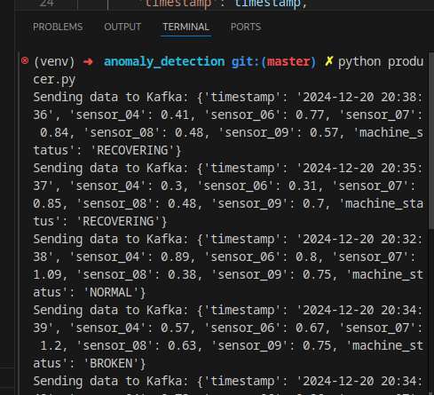
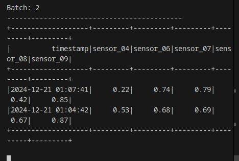
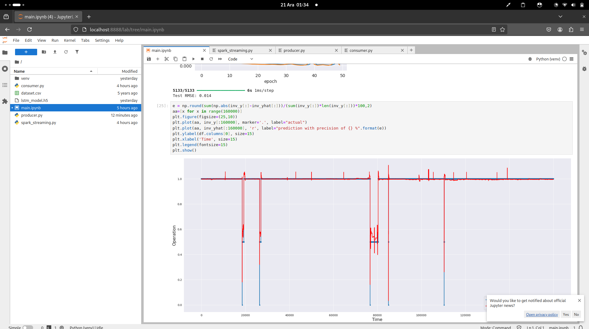

Bu çalışmada endüstriyel pompalardaki veriler kullanılarak bir LSTM modeli geliştirilmiş, Spark ve Kafka entegrasyonuyla gerçek zamanlı anomali tespiti yapılabilecek altyapı geliştirilmiştir. Modelin test verilerindeki hata oranı oldukça düşük 0.014’tür. 
1. **Kafka**, sensör verilerini gerçek zamanlı olarak göndermek ve sonuçları almak için kullanılır.
2. **Spark Streaming**, Kafka'dan gelen verileri okuyup işleyerek gerçek zamanlı veri analizi ve anomali tespiti yapar.
3. **TensorFlow**, verileri LSTM modeline besler ve tahminleri Kafka'ya geri gönderir.

producer.logs

spark_streaming.logs:

model geliştirme aşamasından görüntü main.ipynb:

